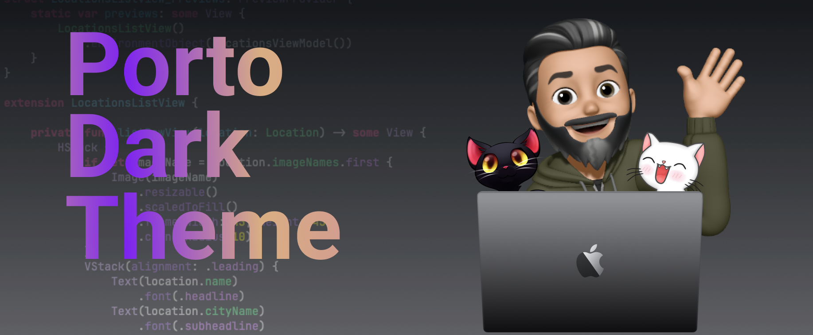
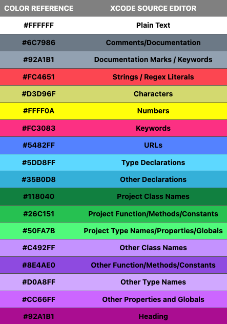
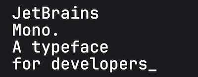
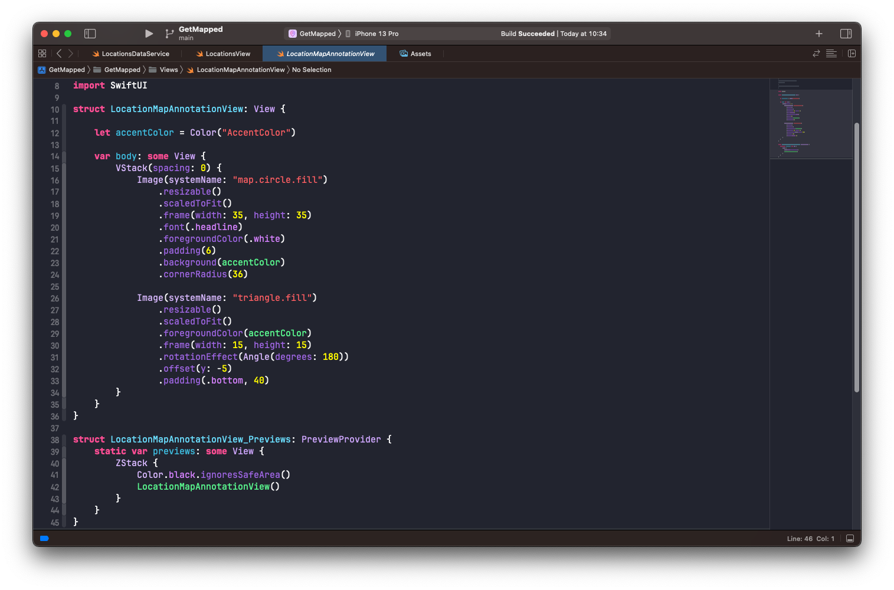
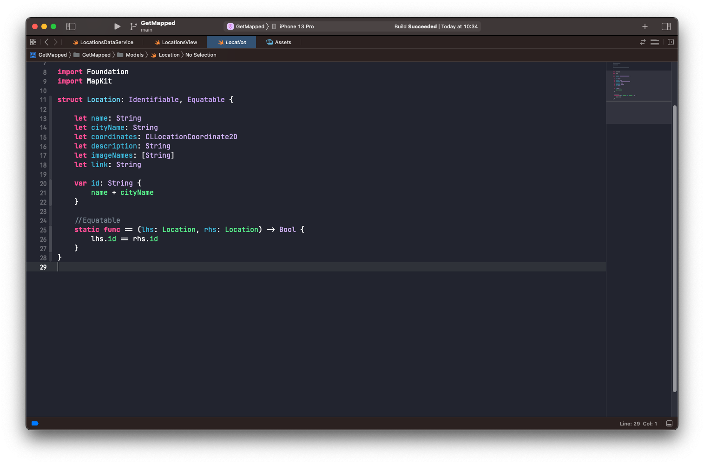
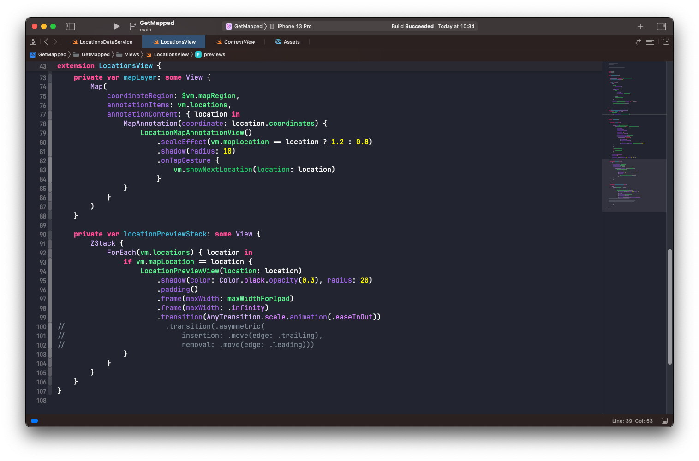
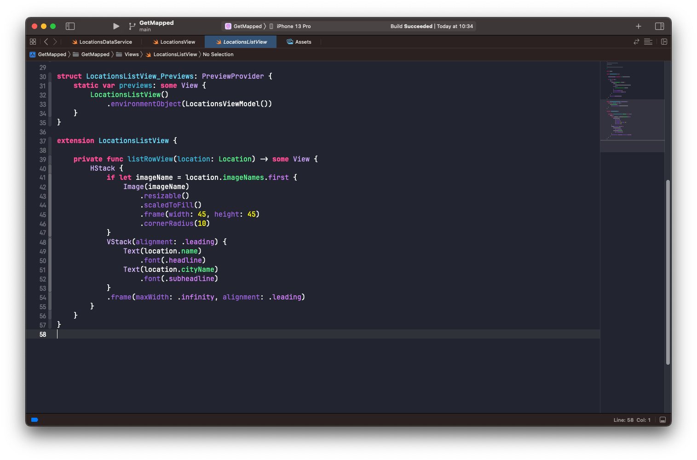

This is a port of the original Xcode Classic Dark theme.

## Installation

1. You can install the theme by downloading the "Porto Dark.xccolortheme" theme file and copying it to:

```ruby
   ~/Library/Developer/Xcode/UserData/FontAndColorThemes
```

2. Restart Xcode.
3. Go to preferences and select Porto Dark.

> **Warning**: If the folder doesn't exist, create it manually!

## Color Palette



<!-- <style>
    .heatMap td {
      color: black;
      font-weight: bold;
    }
    .heatMap {
        width: 70%;
        text-align: center;
    }
    .heatMap th {
        background: grey;
        word-wrap: break-word;
        text-align: center;
    }
    .heatMap tr:nth-child(1) { background: #FFFFFF; }
    .heatMap tr:nth-child(2) { background: #6C7986; }
    .heatMap tr:nth-child(3) { background: #92A1B1; }
    .heatMap tr:nth-child(4) { background: #FC4651; }
    .heatMap tr:nth-child(5) { background: #D3D96F; }
    .heatMap tr:nth-child(6) { background: #FFFF0A; }
    .heatMap tr:nth-child(7) { background: #FC3083; }
    .heatMap tr:nth-child(8) { background: #5482FF; }
    .heatMap tr:nth-child(9) { background: #5DD8FF; }
    .heatMap tr:nth-child(10) { background: #35B0D8; }
    .heatMap tr:nth-child(11) { background: #118040; }
    .heatMap tr:nth-child(12) { background: #26C151; }
    .heatMap tr:nth-child(13) { background: #50FA7B; }
    .heatMap tr:nth-child(14) { background: #C492FF; }
    .heatMap tr:nth-child(15) { background: #8E4AE0; }
    .heatMap tr:nth-child(16) { background: #D0A8FF; }
    .heatMap tr:nth-child(17) { background: #CC66FF; }
    .heatMap tr:nth-child(18) { background: #AA0D91; }

</style>

<div class="heatMap">

| COLOR REFERENCE | XCODE SOURCE EDITOR                   |
| --------------- | ------------------------------------- |
| #FFFFFF         | Plain Text                            |
| #6C7986         | Comments/Documentation                |
| #92A1B1         | Documentation Marks / Keywords        |
| #FC4651         | Strings / Regex Literals              |
| #D3D96F         | Characters                            |
| #FFFF0A         | Numbers                               |
| #FC3083         | Keywords                              |
| #5482FF         | URLs                                  |
| #5DD8FF         | Type Declarations                     |
| #35B0D8         | Other Declarations                    |
| #118040         | Project Class Names                   |
| #26C151         | Project Function/Methods/Constants    |
| #50FA7B         | Project Type Names/Properties/Globals |
| #C492FF         | Other Class Names                     |
| #8E4AE0         | Other Function/Methods/Constants      |
| #D0A8FF         | Other Type Names                      |
| #CC66FF         | Other Properties and Globals          |
| #92A1B1         | Heading                               |

</div> -->

## Font

The theme uses the excellent open-source font [JetBrains Mono](https://www.jetbrains.com/pt-br/lp/mono/) that uses ligatures to reduce noise by blending symbols and removing details so the eyes process less.

Recommended settings for Xcode:

1. Font: JetBrains Mono Regular
2. Font size: 15.
3. Keywords font: JetBrains Mono Extra Bold, size 15.

These are my personal configurations. Do your own tests and find out the font size and configurations that best suits your needs.

You can download JetBrains Mono [HERE](https://www.jetbrains.com/pt-br/lp/mono/ "download")



## Screenshots





